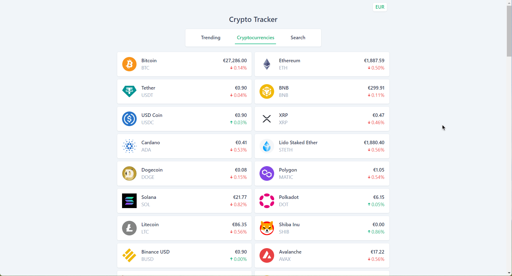

## Cryptocurrency Tracker

This project is a cutting-edge web application that provides users with real-time tracking of the top 100 cryptocurrencies. With an intuitive and user-friendly interface, it allows users to monitor the prices and information of their favorite cryptocurrencies.

The application features a comprehensive main tab that displays the top 100 crypto coins with their current prices in both EUR and USD, a trending coins tab for staying updated with the latest market trends, and a search functionality for finding specific cryptocurrencies. Moreover, this web app offers an interactive modal that shows a detailed price chart using Chart.js, showcasing the last 7 days' price trend, and other key information about the selected coin.

## Features

- **Top 100 Cryptocurrencies:** The main tab displays the top 100 cryptocurrencies with their current prices, providing users with an overview of the cryptocurrency market.

- **Trending Coins:** The application also has a tab that displays the trending coins, helping users to stay updated with the latest trends in the cryptocurrency market.

- **Detailed Modal:** Users can click on the coin logo to open a modal that shows a graph depicting the last 7 days' price trend of the selected coin. The modal also displays other relevant information about the coin, such as its name, symbol, market cap, and more.

- **Currency Conversion:** The application allows users to change the displayed currency between EUR and USD, providing flexibility for users to view prices in their preferred currency.

- **Search Functionality:** The application provides a search functionality that allows users to search for specific cryptocurrencies, making it easy for them to find and track their favorite coins.

## Technologies

- React, Typescript, Tailwind CSS, React Query.

- Chart.js: A powerful charting library for creating interactive and responsive charts.

- CoinGecko API: A free and reliable API for fetching cryptocurrency data, including prices and other relevant information.

## Demo

You can see a live demo of the CryptoTrack application [right here](https://feliperdamaceno.github.io/crypto-tracker).

## Licence

This is an open-source project and is available under the [**MIT License**](LICENSE). You are free to use, modify, and distribute the code in accordance with the terms of the license.

## Contributors

Contributions are highly appreciated! If you encounter any issues or have suggestions for improvements, please feel free to open an issue or submit a pull request.

[feliperdamaceno](https://github.com/feliperdamaceno)

## Contact me

Linkedin: [feliperdamaceno](https://www.linkedin.com/in/feliperdamaceno)
